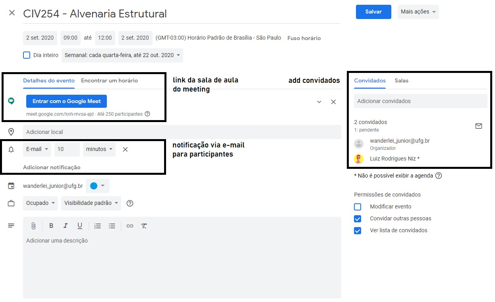

# Ensino _online_ e o Pacote **G-SUITE**

1. Ministrante: [Profa. Sylvia Regina Mesquita de Almeida](http://lattes.cnpq.br/1855764480221018)  
2. Apoio: [Prof. Wanderlei Malaquias Pereira Junior](http://lattes.cnpq.br/2268506213083114) e [Luiz Rodrigues Niz](https://www.linkedin.com/in/luiz-rodrigues-niz-917828119/)

<p style='text-align: justify;'>Você se inscreveu no Minicurso <b>Ensino <i>online</i> e o Pacote G-SUITE</b>. Esse minicurso tem como objetivo apresentar as possibilidades de uso do pacote G-SUITE da GOOGLE no ensino remoto. Antes de começarmos recomendamos que você instale o navegador <a href="https://www.google.com/intl/pt-BR/chrome/">Google Chrome </a>.</p>

<p style='text-align: justify;'>Para você que ainda não usou o conteúdo virtual do sistema GITHUB.IO perceberá que os <i>links</i> estão sublinhados, dessa forma você usuário poderá ter acesso a outro material através desse <i>link</i>.</p>

<p style='text-align: justify;'>Nesse conteúdo <i>online</i> o participante poderá ter mais detalhes sobre as ferramentas informadas pelo ministrante. O material apresenta uma série de explicações e vídeos de domínio público (plataforma YouTube). As referências de todos os vídeos e imagens utilizadas estão descritos na aba de referências.</p> 

### Criação do e-mail institucional ou uso de uma conta GOOGLE

<p style='text-align: justify;'>Para o uso de todas as ferramentas do Pacote G-SUITE é necessário que professores e alunos estejam utilizando um login da Google, ou seja, um login com extensão <code>@gmail.com</code>. Para criar um login desse tipo acesse o site de <a href="https://www.google.com/intl/pt-BR/chrome/"><u>criação do gmail</u></a>. A outra opção é usar o e-mail institucional que contenha o pacote G-SUITE. Um exemplo de criação do e-mail institucional é apresentado pelo <code>canal UFG Oficial [1]</code>.</p>

<center> <iframe width="300" height="169" src="https://www.youtube.com/embed/1himTC7BNTE" frameborder="0" allow="accelerometer; autoplay; encrypted-media; gyroscope; picture-in-picture" allowfullscreen></iframe> </center>


### Uso do calendário do pacote G-SUITE

<p style='text-align: justify;'>O uso do calendário é fundamental para agendar as aulas com os discentes usando o pacote G-SUITE, pelo calendário você poderá avisa-lós sobre o horário da aula e criar lembretes automáticos conforme a Figura abaixo:</p>



<p style='text-align: justify;'>Para mostrar um pouco do funcionamento dessa plataforma segue o conteúdo do <code>canal GetEdu [2]</code>:</p>

<center> <iframe width="300" height="169" src="https://www.youtube.com/embed/bKeqCNvftTI" frameborder="0" allow="accelerometer; autoplay; encrypted-media; gyroscope; picture-in-picture" allowfullscreen></iframe> </center>

<p style='text-align: justify;'>Em caso de utilização de outra plataforma de gravação como por exemplo o <i>software freeware</i> <a href="https://atube-catcher.br.uptodown.com/windows"><i>aTube Catcher</i></a> o vídeo da gravação poderá ser anexado na reunião do calendário e portanto essa filmagem ficará disponível para que os discentes tenham acesso em outro momento.</p>

<p style='text-align: justify;'>Para quem deseja saber como usar a ferramenta <i>aTube Catcher</i> na gravação da aula poderá ver o conteúdo do <code>canal EducaTICs [3]</code>.</p>
          
<center> <iframe width="300" height="169" src="https://www.youtube.com/embed/OE7Hrt0tAew" frameborder="0" allow="accelerometer; autoplay; encrypted-media; gyroscope; picture-in-picture" allowfullscreen></iframe> </center>

### Uso do Google Meeting do pacote G-SUITE

<p style='text-align: justify;'>O Google Meeting é o ambiente de reunião virtual da Google. Nesse ambiente poderão ser ministradas as aulas síncronas com uma capacidade de total de 250 participantes sendo que essa sala poderá ser criada pelo professor da disciplina. O link da sala é um caminho que poderá ser digitado no navegador (recomendado o uso do navegador Google Chrome). O modelo do <i>link</i> segue o seguinte formato: <code>https://meet.google.com/knh-mvsa-ajd</code>.</p>

<p style='text-align: justify;'>O sistema para criação de reuniões mostrado anteriormente é o sistema de reunião planejada onde as pessoas convidadas já tem permissão direta para entrada na sala. Também é possível a criação de reuniões diretamente pelo Google Meeting conforme no conteúdo apresentado pelo <code>canal do IEP3 da Unesp (Universidade Estadual Paulista - Júlio de Mesquita Filho) [4]</code>:</p>

<center> <iframe width="300" height="169" src="https://www.youtube.com/embed/gW-ncVx3G8I" frameborder="0" allow="accelerometer; autoplay; encrypted-media; gyroscope; picture-in-picture" allowfullscreen></iframe> </center>

<p style='text-align: justify;'>Após a criação e disponibilização da sala de reuniões o professor poderá acessar essa sala juntamente com seus alunos e então o conteúdo poderá ser ministrado com a utilização de recursos de compartilhamento de tela. Abaixo alguns conteúdos do <code>canal Curso Rápido [5,6]</code> que demonstra a configuração e utilização do Google Meeting.</p>

<center> <iframe width="300" height="169" src="https://www.youtube.com/embed/I50qnfMSaH4" frameborder="0" allow="accelerometer; autoplay; encrypted-media; gyroscope; picture-in-picture" allowfullscreen></iframe> </center>

<center> <iframe width="300" height="169" src="https://www.youtube.com/embed/QRyA2uaM2hA" frameborder="0" allow="accelerometer; autoplay; encrypted-media; gyroscope; picture-in-picture" allowfullscreen></iframe> </center>

<p style='text-align: justify;'>Antes de utilizar o Google Meeting não se esqueça de testar microfone e câmera conforme recomendação dos vídeos de domínio público para que no momento da aula você não seja pego de surpresa!!!</p>

### Um pouco sobre o modelo de apresentação em Power Point

<p style='text-align: justify;'>Para aqueles que vão utilizar o Microsoft Power Point como recurso de apresentação vão algumas dicas para elaboração dos slides:</p>

1. Para um melhor aproveitamento do espaço em tela utilize o tamanho de slide **_Widescreen-16:9_** (aba _Design_) pois esse modelo permite a utilziação maximizada em celulares e _tablets_;
2. A apresentação não pode ser muito carregada isso poderá deixar o discente "perdido" no momento da exposição;
3. A combinações de cores é muito importante no recurso da apresentação portanto sugerimos a utilização de [padrões de cores com a ferramenta _*adobe color*_](https://color.adobe.com/pt/create/color-wheel);
4. Caso necessite figuras ou imagens diversos sites disponibilizam isso de forma gratuita como por exemplo: [__Flaticon__](https://www.flaticon.com), [__Unplash__](https://unsplash.com) e o site [__Freepik__](https://br.freepik.com). Não se esqueça de referenciar todo o conteúdo utilizado.

### Uso do Jamboard do pacote G-SUITE

<p style='text-align: justify;'>Para aqueles professores que desejam utilizar quadro, o ideal é o uso das telas com sensor para escrita, como os celulares, <i>tablets</i> ou uma mesa digitalizadora. A ferramenta de quadro do pacote G-SUITE é o Jamboard. O Jamboard permite o compartilhamento de arquivos, colocação de imagens e também a escrita de equações matemáticas. O canal da Priscilla Prueter [7] apresenta exemplos da criação de quadros pelo Jamboard.</p>

<center> <iframe width="300" height="169" src="https://www.youtube.com/embed/sbsE2dqYK9M" frameborder="0" allow="accelerometer; autoplay; encrypted-media; gyroscope; picture-in-picture" allowfullscreen></iframe> </center>

### Uso do Classroom do pacote G-SUITE

<p style='text-align: justify;'>A extensão <i>Classroom</i> é o pacote que concatena todas as possibilidades citadas anteriormente. O ambiente <i>Classroom</i> permite a criação virtual de uma sala de aula. Esse sistema permite a postagem de conteúdo, atividades com pontuação e outras diversas possibilidades que um professor teoricamente poderia fazer em sala. Para uma visão geral da ferramenta segue os vídeos do <code>canal do Professus21 [8]</code>.</p>

<center> <iframe width="300" height="169" src="https://www.youtube.com/embed/v_vEXrhYvoU" frameborder="0" allow="accelerometer; autoplay; encrypted-media; gyroscope; picture-in-picture" allowfullscreen></iframe> </center>


### Referências

```
[1] Canal UFG Oficial, Tutorial para criação de login único e e-mail institucional da UFG. Youtube. Disponível em: <https://www.youtube.com/watch?time_continue=56&v=1himTC7BNTE&feature=emb_title>. Acesso em: 01 de set. 2020. 01:43

[2] Maciel, W. Canal GetEdu, Google Agenda como criar eventos. Youtube. Disponível em: <https://www.youtube.com/embed/bKeqCNvftTI>. Acesso em: 01 de set. 2020. 07:57

[3] Canal EducaTICs, Como gravar a tela do computador com aTube Catcher?. Youtube. Disponível em: <https://www.youtube.com/watch?v=OE7Hrt0tAew&feature=emb_title>. Acesso em: 01 de set. 2020. 11:23

[4] Ferreira, A. L. R. Canal Instituto de Educação e Pesquisa em Práticas Pedagógicas (IEP3) da Unesp, Tutorial Básico Google Meet. Youtube. Disponível em: <https://www.youtube.com/watch?v=gW-ncVx3G8I&feature=emb_title>. Acesso em: 01 de set. 2020. 05:31

[5] Canal Curso Rápido, Como usar GOOGLE MEET – Videoconferência, Reuniões e Aulas. Passo a Passo. Youtube. Disponível em: <https://www.youtube.com/watch?v=I50qnfMSaH4&feature=emb_title>. Acesso em: 01 de set. 2020. 16:06

[6] Canal Curso Rápido, GOOGLE MEET- Como apresentar PowerPoint, Quadro Branco e Legendas. Youtube. Disponível em: <https://www.youtube.com/watch?v=QRyA2uaM2hA&feature=emb_title>. Acesso em: 01 de set. 2020. 16:06

[7] Canal Priscilla Prueter, Jamboard para aulas e ensaios criativos!. Youtube. Disponível em: <https://www.youtube.com/watch?v=sbsE2dqYK9M>. Acesso em: 01 de set. 2020. 06:51

[8] Silva, W. Canal Professus21, Curso Google Classroom. Youtube. Disponível em: <https://www.youtube.com/watch?v=v_vEXrhYvoU&list=PLTQMKsLxzddJY1u-ftKzQXEBu8E3ezbNH&index=1>. Acesso em: 01 de set. 2020. 08:00

```

